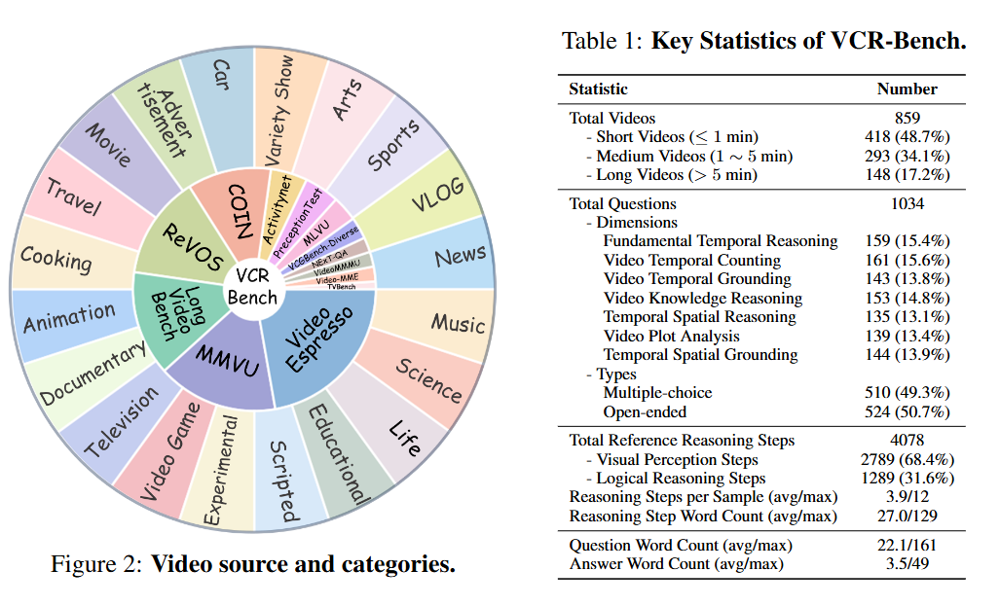
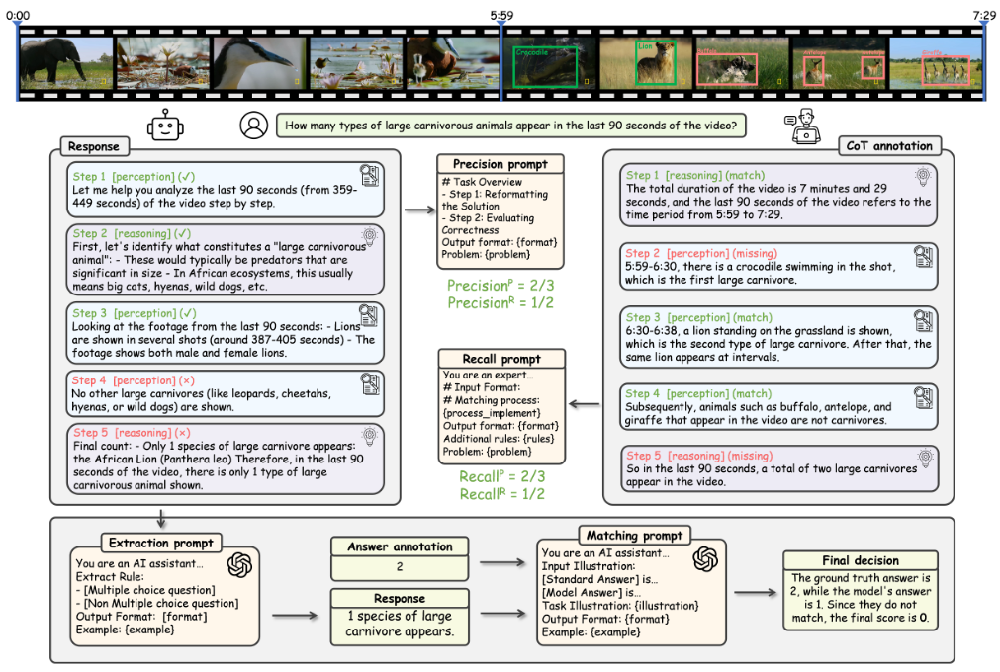

<!-- intro fig eval-pipeline 需要的文件-->

# VCR-Bench: A Comprehensive Evaluation Framework for Video Chain-of-Thought Reasoning

 
 
  


<font size=7><div align='center' >  [[🌐 Homepage](https://vlm-reasoning.github.io/VCR-Bench/)][[📖 arXiv Paper](https://arxiv.org/pdf/2504.07956)] [[📊 Dataset](https://huggingface.co/datasets/VLM-Reasoning/VCR-Bench)]  [[🏆 Leaderboard](https://vlm-reasoning.github.io/VCR-Bench/#leaderboard)]  </div></font>

---

## 🔥 News
* **`2025.07.05`** 🌟 **VCR-Bench** has been supported in the [**VLMEvalKit**](https://github.com/open-compass/VLMEvalKit) repository
* **`2025.04.11`** 🌟 We have released **VCR-Bench**, a novel benchmark designed to comprehensively evaluate LVLMs' **V**ideo **C**hain-of-Thought **R**easoning capabilities

---

## 👀 Introduce VCR-Bench

<p align="center">
    
</p>

We introduce **VCR-Bench**, a novel benchmark designed to comprehensively evaluate LVLMs' **V**ideo **C**hain-of-Thought **R**easoning capabilities. VCR-Bench comprises 859 videos spanning a variety of video content and durations, along with 1,034 high-quality question-answer pairs. Each pair is manually annotated with a stepwise CoT rationale, where every step is tagged to indicate its association with the perception or reasoning capabilities. Furthermore, we design seven distinct task dimensions and propose the CoT score to assess the entire CoT process based on the stepwise tagged CoT rationals.

<p align="center">
    
</p>

## 🔮 Evaluation
📍 **Data Preparation**:

Download the data from [HuggingFace](https://huggingface.co/datasets/VLM-Reasoning/VCR-Bench).
```
git lfs install
git clone https://huggingface.co/datasets/VLM-Reasoning/VCR-Bench
```

We have provided the original video data and data with an average of 64 frames. If you need data with other frame counts, you can refer to the following instructions：
```
python avg_cut_frames.py --input_json  meta_info_video.json --output_json meta_info_64_frames.json --num_frames 64
```


📍 **Inference**:

Our evaluation relies on the API call of GPT4o. You need to first replace the **get_output_wo_image** function in **eval_code/eval.py** with your API call function.

Then run the following script to obtain the evaluation results:
```
python eval_code/eval.py \
    --input input.json \          # Path to model inference results (JSON format) 
    --output output.json \        # Path to save GPT4o evaluation results
    --workers 50                  # Number of concurrent API call threads
```

Calculate the CoT score:
```
python eval_code/cau_total.py output.json
```
Calculate the accuracy:
```
python eval_code/cau_acc.py output.json
```


## ✒️ Citation

If you find our work helpful for your research, please consider giving a star ⭐ and citation 📝
```bibtex
@article{qi2025vcr,
  title={VCR-Bench: A Comprehensive Evaluation Framework for Video Chain-of-Thought Reasoning},
  author={Qi, Yukun and Zhao, Yiming and Zeng, Yu and Bao, Xikun and Huang, Wenxuan and Chen, Lin and Chen, Zehui and Zhao, Jie and Qi, Zhongang and Zhao, Feng},
  journal={arXiv preprint arXiv:2504.07956},
  year={2025}
}
```